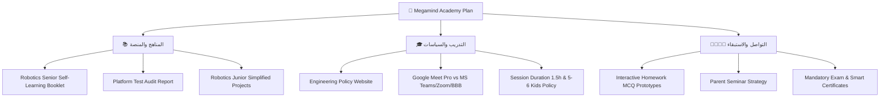

# 🚀 Megamind Academy - Executive Action Dashboard & Curriculum Hub
> **لوحة العمل التنفيذية وإدارة المناهج والمسارات الأكاديمية - Megamind Academy (Kids Tech & Robotics)**


---

## 📖 جدول المحتويات (Table of Contents)
1. [🌟 نظرة عامة عن المشروع (Overview)](#-نظرة-عامة-عن-المشروع-overview)
2. [🖥️ مميزات لوحة التحكم التنفيذية (Dashboard Features)](#-مميزات-لوحة-التحكم-التنفيذية-dashboard-features)
3. [📂 الصفحات والمستندات والتقارير التفاعلية (Interactive Demos & Reports)](#-الصفحات-والمستندات-والتقارير-التفاعلية-interactive-demos--reports)
4. [📋 جدول متابعة خريطة المهام الأكاديمية (Executive Tasks Matrix)](#-جدول-متابعة-خريطة-المهام-الأكاديمية-executive-tasks-matrix)
5. [🤖 دراسة تبسيط مشاريع Robot Junior Advanced](#-دراسة-تبسيط-مشاريع-robot-junior-advanced)
6. [🛠️ البنية التقنية وطريقة التشغيل (Tech Architecture & Usage)](#️-البنية-التقنية-وطريقة-التشغيل-tech-architecture--usage)

---

## 🌟 نظرة عامة عن المشروع (Overview)

تم بناء هذا المشروع ليكون **لوحة متابعة تنفيذية تفاعلية وقاعدة معرفية شاملة (Executive Interactive Action Board)** لقيادة **Megamind Academy** (تحت إشراف **الباشمهندس أحمد CEO** و**المدير التعليمي Educational Director**).

يهدف النظام إلى متابعة وتطوير مناهج الروبوتكس والبرمجة والذكاء الاصطناعي للأطفال، توثيق لوائح وسياسات تشغيل المهندسين، فحص واختبار المنصة الجديدة، وإصدار دراسات مقارنة مالية وتقنية لبنية الفيديو والبث المباشر.

> [!IMPORTANT]
> **القيادة المستهدفة:** تتيح اللوحة التفاعل اللحظي، فلترة المهام حسب المسؤول أو الأولوية، والضغط المباشر لتغيير حالة المهام وتحديث المؤشرات والرسوم البيانية لحظياً.

---

## 🖥️ مميزات لوحة التحكم التنفيذية (Dashboard Features)

* **⚡ كروت المؤشرات المباشرة (Executive KPIs):**
  - **إجمالي المهام (Total Tasks):** إحصاء دقيق لكافة المهام الأكاديمية والتشغيلية.
  - **المهام العاجلة (Urgent Tasks):** تظليل العناصر التي تتطلب تدخلاً فورياً.
  - **قيد التنفيذ (In Progress):** متابعة المهام التي يجري تطويرها حالياً.
  - **المهام المكتملة (Completed):** رصد الإنجازات المعتمدة نهائياً.

* **🎯 نظام الفلترة والبحث الذكي (Smart Filter & Search):**
  - تصفية المهام حسب المسند إليه (`م. أحمد CEO` / `المدير التعليمي Educational Director`).
  - تصفية حسب الأولوية (`عاجل 🚨` / `مرتفع 🔥` / `متوسط 📋`).
  - تصفية حسب الحالة اللحظية (`في الانتظار` / `قيد التنفيذ` / `تمت المعالجة`).
  - بحث فوري في عناوين وتفاصيل وتحديثات المهام.

* **📊 رسوم بيانية تفاعلية (Chart.js Visualizations):**
  - توزيع المهام حسب المسؤول (Bar Chart).
  - توزيع الأولويات والأهمية (Doughnut Chart).
  - تقييم المخاطر وتطوير المناهج (Horizontal Bar Chart).

---

## 📂 الصفحات والمستندات والتقارير التفاعلية (Interactive Demos & Reports)

يحتوي المشروع على تقارير وصفحات تفاعلية مستقلة تم تطويرها خصيصاً لدعم اتخاذ القرار:

| اسم المستند / الصفحة | الوصف والهدف التشغيلي | الرابط المباشر |
| :--- | :--- | :---: |
| 📖 **كتيب التعليم الذاتي للروبوتكس (الصفحة الداخلية)** | الكتيب التعليمي التفاعلي الشامل (7 مستويات + أكواد + إجابات) | [robotics-book-demo.html](./robotics-book-demo.html) |
| 📘 **كتيب أساسيات الروبوتكس (Google Notebook)** | الكتيب التعليمي المصور للتعلّم الذاتي المعتمد عبر Google Notebook | [عرض الكتيب 🌐](https://notebook.google.com/notebook/ba068196-9886-49eb-bca3-f33718919c77/artifact/8c2b324a-d227-4a20-a025-a06a442c6c7a) |
| 🧪 **تقرير فحص وتست المنصة الجديدة** | تقرير تفصيلي لـ 6 جلسات تست (6 مهندسين) وتوثيق 8 ملاحظات وعيوب برمجية | [platform-test-report.html](./platform-test-report.html) |
| 📹 **دراسة منصات الفيديو وتجربة Google Meet Pro** | مقارنة (Teams, Meet Pro, Zoom, BBB)، وتقييم Remote Desktop و Drive 5TB الميداني | [meeting-platforms-comparison.html](./meeting-platforms-comparison.html) |
| 🌐 **موقع سياسات وإرشادات المهندسين** | وثيقة اللوائح والجزاءات ونظام البونص والحوافز للمهندسين | [موقع السياسات 🌐](https://megamindaccademy.github.io/Engineering-policy/) |
| 🎮 **مقترح واجب PictoBlox التفاعلي** | نموذج تفاعلي لكويز الواجبات الفورية (MCQ) ثنائي اللغة لشعبة PictoBlox | [pictoblox-homework-session1.html](./pictoblox-homework-session1.html) |
| 🐍 **مقترح واجب Python التفاعلي** | نموذج تفاعلي لكويز الواجبات الفورية (MCQ) ثنائي اللغة لشعبة البايثون | [python-homework-session1.html](./python-homework-session1.html) |

---

## 📋 جدول متابعة خريطة المهام الأكاديمية (Executive Tasks Matrix)



### 📌 ملخص حالة التكليفات الرئيسة:

1. **وثيقة وسياسات المهندسين (Engineering Policy):** تم الإنجاز بالكامل والموقع التفاعلي جاهز.
2. **المحتوى التفاعلي للمناهج (Interactive Web Curriculum):** تم تسليم ملف `problemsolving.zip` بحجم 29.1MB.
3. **دراسة وتجربة منصات الاجتماعات وGoogle Meet Pro:** تم فحص التجربة الميدانية لـ Google Meet Pro وتحديد تحديات Remote Desktop و 5TB Drive وحفظ الفيديوهات وثغرة الميتنجات المتزامنة.
4. **فحص واختبار المنصة الجديدة (QA Audit):** تم توثيق تقرير الـ 6 جلسات ورصد 8 عيوب برمجية عاجلة.
5. **كتيب أساسيات الروبوتكس والإلكترونيات (Task 9):** تم تسليم الصفحة التفاعلية الشاملة (`robotics-book-demo.html`) واكتملت المهمة ✅.
6. **مراجعة مدة الجلسات وسعة المجموعات (Task 16):** تعديل مدة السيشن لـ **1.5 ساعة** وسعة المجموعة لـ **5-6 أطفال** (قيد التنسيق ⏳).
7. **جدولة وتكليف المحاضرين بتوليد اختبارات الـ Forms (Task 17):** جدولة وإسناد مهام صياغة وتوليد النماذج الاختبارية والتقييمات للمناهج كـ Forms لكبار المحاضرين (Instructors) لبدء تفعيلها على موقع المنصة المخصص للطلبة (جاري الجدولة والتكليف ⏳).

---

## 🤖 دراسة تبسيط مشاريع Robot Junior Advanced

بناءً على التقييم الأكاديمي لصعوبة وتكرار مشروع "السيارة الذكية" على أطفال سن (6-10 سنوات)، تم إعداد **4 مشاريع مبسطة وخفيفة للغاية**:

1. 🚦 **إشارة المرور الذكية وبوابة الرادار (Smart Traffic Light & Gate):** (سيرفر + أولتراسونيك + بيزر + LEDs) - *المشروع الأكثر توصية*.
2. 🪙 **صندوق الأسرار والحصالة الذكية (Smart Piggy Bank):** (حساس اقتراب + ذراع غلق للسيرفو).
3. 🌀 **المروحة الذكية وكشاف الأمان (Smart Auto Fan & Light):** (حساس حرارة/ضوء LDR + محرك مروحة).
4. 🎵 **الروبوت العازف والرقاص التفاعلي (Dancing Music Bot):** (حساس صوت + محرك سيرفو راقص).

---

## 🛠️ البنية التقنية وطريقة التشغيل (Tech Architecture & Usage)

### 🧰 التقنيات المستغلة:
* **UI Framework:** Tailwind CSS (CDN) مع تصميم متجاوب 100% يدعم الاتجاه العربي (RTL).
* **Charts Engine:** Chart.js للعروض البيانية اللحظية.
* **Math Rendering:** KaTeX لكتابة المعادلا والرموز الكهربائية.
* **Font:** Google Fonts (`Cairo` & `Fredoka`).
* **State Persistence:** Vanilla JS LocalStorage لمزامنة التغييرات فوراً.

### 💻 التشغيل المحلي والمزامنة:
1. قم بفتح ملف `index.html` في أي متصفح حديث.
2. للتنقل بين التقارير التفاعلية، استخدم الأزرار المباشرة داخل الكروت أو روابط القائمة العلوية.
3. للتعديل والرفع على المستودع:
   ```bash
   git add .
   git commit -m "Update executive dashboard and reports"
   git push origin main
   ```

---

<div align="center">
  <p> Megamind Academy Executive Dashboard • Managed by Educational Director & CEO 🚀</p>
</div>
